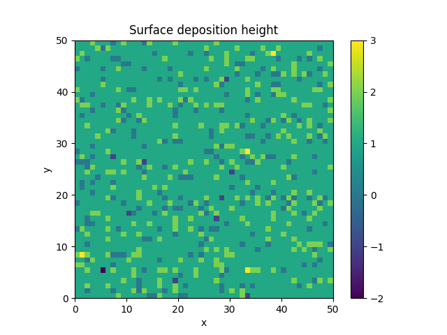
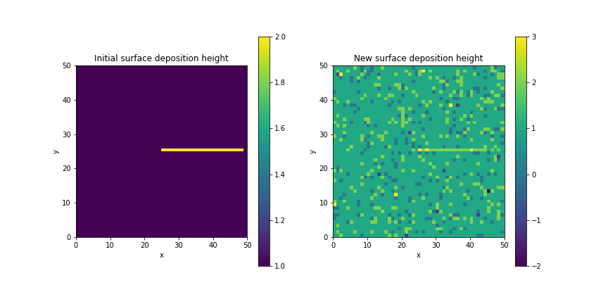
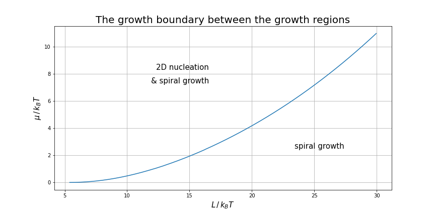
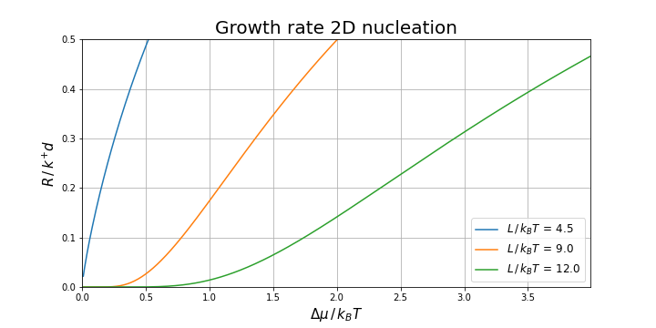

### Week 1

This week the foundations of the code were programmed, with this current framework we are able to perform growth iterations on the crystal face.
For now nothing to crazy is happening, in the code the ratios of the addition, edge, evaporation and impingement energy, need to be fine-tuned to reproduce the effects in the paper.
Since the paper does not directly state these values we need to search the references for these values.

A plot of the deposition height for atoms on the face is shown below:

and

### Week 2

This week we converted all the equations to dimensionless units,
the code was altered to simulate dislocations, and a class was made to streamline the simulation.
Furthermore, the theoretical expected growth regimes were determined through simulation,

and the growth rate for 2D nucleation

Now the growth rate at different conditions have to be simulated and compaired to the growth rate predicted from our simulations and from literature.